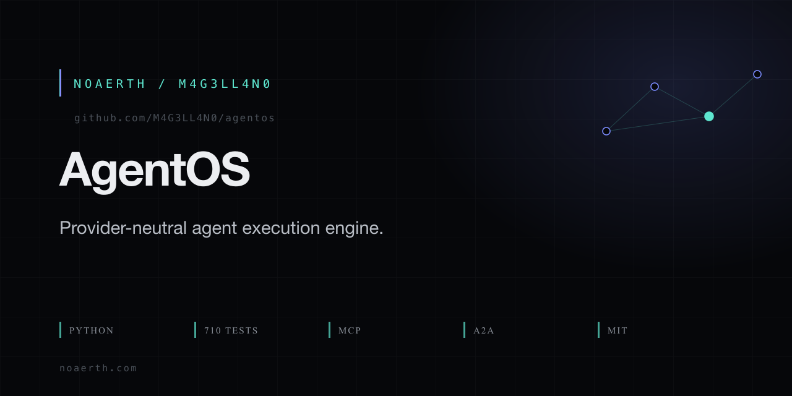

# AgentOS

<p align="center">
  <picture>
    <source media="(prefers-reduced-motion: reduce)" srcset="assets/hero/hero-reduced.svg">
    <source media="(prefers-color-scheme: light)" srcset="assets/hero/hero-light.svg">
    
  </picture>
</p>

<p align="center">
  <picture>
    <source media="(prefers-reduced-motion: reduce)" srcset="assets/hero/computational-dark.svg">
    <source media="(prefers-color-scheme: light)" srcset="assets/hero/computational-light.svg">
    
  </picture>
</p>

<p align="center">
  
</p>

> **A universal, provider-neutral AI Agent Engine that turns objectives into verified outcomes at the lowest responsible cost.**

Public site: https://agentos-website-ten.vercel.app

AgentOS is the generic execution and orchestration engine. It accepts an objective, inspects the current state, discovers capabilities, plans a bounded route, executes through an adapter, verifies the result, persists evidence, and decides what to do next. Humans and AI systems can use the same core through the CLI, loopback HTTP API, or MCP stdio.

AgentOS is intentionally not a fixed swarm, an operating system, or a provider account. It is the substrate that lets a workforce stay replaceable while control, verification, and learning remain durable.

## The north star

**Verified useful output ÷ total resource cost**

The loop is:

```text
objective
  → inspect state
  → discover capabilities
  → plan and route
  → execute through a bounded adapter
  → verify with evidence
  → persist redacted state
  → learn and choose the next action
```

Verified useful output is the goal. Lower cost is a result of choosing the smallest capable path, not a reason to fabricate measurements or skip verification.

## Where it fits

```text
user / PAIOS intent
        ↓
AgentOS objective, routing, execution, verification, learning
        ↓
GrokBot Office workforce configuration
  3 reference supervisors · 131 virtual roles
        ↓
replaceable local, model, MCP, A2A, or external workers
        ↓
evidence and explicit approval boundaries
```

[GrokBot Office](https://github.com/M4G3LL4N0/grokbot-office) is a separate workforce configuration package. It supplies role, policy, context, and handoff data; it is not AgentOS and is not a hidden AgentOS dependency. The [GrokBot Office website](https://github.com/M4G3LL4N0/grokbot-office-website) explains that operating model visually.

## Quickstart

```bash
git clone https://github.com/M4G3LL4N0/agentos.git
cd agentos
python3.11 -m venv .venv
.venv/bin/python -m pip install -e .
export AGENTOS_HOME="$(mktemp -d)"
.venv/bin/agentos --version
.venv/bin/agentos init
.venv/bin/agentos status
.venv/bin/agentos delegate "Say hello" --operation echo --params '{"hello":"world"}'
.venv/bin/agentos run "<objective-id>" --explain
.venv/bin/agentos inspect "<objective-id>"
.venv/bin/agentos doctor
```

The `delegate` command returns the objective identifier used by the next command. The default execution mode is bounded and simulated unless a caller explicitly supplies the required authorization. No provider credential is required for the local path.

## Useful commands

```bash
.venv/bin/agentos objective create "Audit the project" --operation fs.list --params '{"path":"."}'
.venv/bin/agentos capabilities list --refresh
.venv/bin/agentos capabilities inspect --readiness
.venv/bin/agentos efficiency benchmark
.venv/bin/agentos backup create --output-dir ./backups
.venv/bin/agentos backup inspect ./backups/<archive>.tar.gz
.venv/bin/agentos backup restore ./backups/<archive>.tar.gz --dry-run
.venv/bin/agentos serve --host 127.0.0.1 --port 8765
.venv/bin/agentos mcp
```

Every command supports the global `--json` option where structured output is useful. Use `--home DIR` or `AGENTOS_HOME` to keep experiments isolated. The local API is loopback-oriented and has no production authentication layer.

## Capability categories

| Category | Boundary |
| --- | --- |
| **VERIFIED** | CLI, HTTP, and MCP stdio surfaces share one core; SQLite persistence; provider-neutral adapters; policy gates; bounded execution; verification; recovery; learning; backup inspection and restore dry-run; local benchmark. The 710-test release suite is green. |
| **OPTIONAL** | Configured local CLIs, filesystem and shell adapters, OpenCode/GitHub/xAI/Grok/OpenClaw adapter code paths, federation metadata, A2A and MCP discovery surfaces, and read-only GrokBot Office bridging when their external prerequisites exist. |
| **UNCONFIGURED** | Live provider credentials, production API authentication, remote peer credentials, external account state, and any claim that a worker is currently live. |
| **EXPERIMENTAL** | Ecosystem discovery/certification, autonomy records, resource-governor policy extensions, and learned routing that still require measured operator evidence before being used for consequential work. |
| **PLANNED** | A production sandbox, multi-user API auth, a first-class MCP client, portable schema migrations, and additional human approval surfaces. |

A capability being detected, registered, simulated, or marked `AVAILABLE` is not the same as a live or verified external execution. The CLI and docs preserve that distinction.

## Architecture

The core is layered and shared across interfaces:

```text
CLI / HTTP API / MCP stdio
          ↓
services.AgentOS
          ↓
engine · router · policies · verification
          ↓
capability registry and adapters
          ↓
SQLite store and event log
```

Important implementation documents:

- [`ARCHITECTURE.md`](ARCHITECTURE.md) — layers, module map, and execution flow.
- [`NORTHSTAR.md`](NORTHSTAR.md) — mission, loop, principles, and non-goals.
- [`FEDERATION.md`](FEDERATION.md) — provider-neutral executor cells and routing boundaries.
- [`GROKBOT_PROVIDER.md`](GROKBOT_PROVIDER.md) — optional read-only GrokBot Office bridge.
- [`RESOURCE_GOVERNOR.md`](RESOURCE_GOVERNOR.md) — measured resource policy and bounded fan-out.
- [`SECURITY.md`](SECURITY.md) — publication and secret-handling boundary.
- [`RELEASE_NOTES.md`](RELEASE_NOTES.md) — v0.5.0 evidence and limitations.

## Testing

```bash
.venv/bin/python -m compileall -q src
.venv/bin/python -m unittest discover -s tests
```

The release candidate is Python 3.11+ and uses only the standard library at runtime. CI runs the supported test matrix, compilation, packaging checks, and a lightweight repository secret scan. Tests use temporary state and do not require live providers.

## Release

The current release is **v0.5.0**. It is tagged only after the public repository commit and release gate are verified. The local release evidence includes 710 passing tests, zero failures, zero errors, zero skips, an 11-task deterministic benchmark, CLI smoke checks, and backup/source audits.

## Contributing

Read [`CONTRIBUTING.md`](CONTRIBUTING.md) before changing execution paths. Keep provider-specific behavior behind adapters, add regression tests for new execution behavior, and keep private state out of source, fixtures, logs, and documentation.

## Security

Do not submit secrets, cookies, sessions, credentials, private account state, harvested material, or machine-specific paths. See [`SECURITY.md`](SECURITY.md) for the public boundary and reporting expectations.

## License

MIT. See [`LICENSE`](LICENSE).

<!-- TRILLIONX:presentation:begin -->

### Animated surfaces

Generated from this repository's own source tree: every count, route and module below was measured, not written by hand.

#### Identity

<picture>
  <source media="(prefers-reduced-motion: reduce)" srcset="https://raw.githubusercontent.com/M4G3LL4N0/agentos/main/.github-art/surfaces/hero-reduced.svg">
  <source media="(prefers-color-scheme: light)" srcset="https://raw.githubusercontent.com/M4G3LL4N0/agentos/main/.github-art/surfaces/hero-light.svg">
  
</picture>

#### Entry points

<picture>
  <source media="(prefers-reduced-motion: reduce)" srcset="https://raw.githubusercontent.com/M4G3LL4N0/agentos/main/.github-art/surfaces/terminal-reduced.svg">
  <source media="(prefers-color-scheme: light)" srcset="https://raw.githubusercontent.com/M4G3LL4N0/agentos/main/.github-art/surfaces/terminal-light.svg">
  
</picture>

#### Modules

<picture>
  <source media="(prefers-reduced-motion: reduce)" srcset="https://raw.githubusercontent.com/M4G3LL4N0/agentos/main/.github-art/surfaces/architecture-reduced.svg">
  <source media="(prefers-color-scheme: light)" srcset="https://raw.githubusercontent.com/M4G3LL4N0/agentos/main/.github-art/surfaces/architecture-light.svg">
  
</picture>

#### Primitives

<picture>
  <source media="(prefers-reduced-motion: reduce)" srcset="https://raw.githubusercontent.com/M4G3LL4N0/agentos/main/.github-art/surfaces/state_machine-reduced.svg">
  <source media="(prefers-color-scheme: light)" srcset="https://raw.githubusercontent.com/M4G3LL4N0/agentos/main/.github-art/surfaces/state_machine-light.svg">
  
</picture>

#### Build and tests

<picture>
  <source media="(prefers-reduced-motion: reduce)" srcset="https://raw.githubusercontent.com/M4G3LL4N0/agentos/main/.github-art/surfaces/build-reduced.svg">
  <source media="(prefers-color-scheme: light)" srcset="https://raw.githubusercontent.com/M4G3LL4N0/agentos/main/.github-art/surfaces/build-light.svg">
  
</picture>

#### Workflow

<picture>
  <source media="(prefers-reduced-motion: reduce)" srcset="https://raw.githubusercontent.com/M4G3LL4N0/agentos/main/.github-art/surfaces/workflow-reduced.svg">
  <source media="(prefers-color-scheme: light)" srcset="https://raw.githubusercontent.com/M4G3LL4N0/agentos/main/.github-art/surfaces/workflow-light.svg">
  
</picture>

#### Domain

<picture>
  <source media="(prefers-reduced-motion: reduce)" srcset="https://raw.githubusercontent.com/M4G3LL4N0/agentos/main/.github-art/surfaces/domain-reduced.svg">
  <source media="(prefers-color-scheme: light)" srcset="https://raw.githubusercontent.com/M4G3LL4N0/agentos/main/.github-art/surfaces/domain-light.svg">
  
</picture>

#### Identity object

<picture>
  <source media="(prefers-reduced-motion: reduce)" srcset="https://raw.githubusercontent.com/M4G3LL4N0/agentos/main/.github-art/surfaces/footer-reduced.svg">
  <source media="(prefers-color-scheme: light)" srcset="https://raw.githubusercontent.com/M4G3LL4N0/agentos/main/.github-art/surfaces/footer-light.svg">
  
</picture>

<!-- TRILLIONX:presentation:end -->

<!-- TRILLIONX:evidence:begin -->

## What is measurable here

Generated by `.github-art` from the source tree at publish time.

| Signal | Value |
| --- | --- |
| HTTP routes | 0 |
| Entry points | 2 |
| Module roots | 1 |
| Test files | 44 |
| CI workflows | 1 |
| Distinctive stack | scaffold only |
| Status | LIVE |
| Evidence confidence | E3 |
| Animated surfaces | 8 |

<!-- TRILLIONX:evidence:end -->
